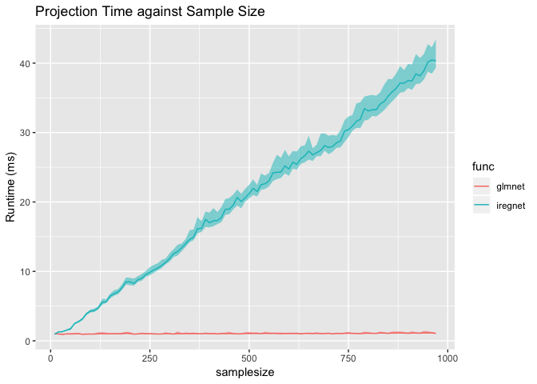

Easy Test for iregnet on CRAN
================
Ao Ni
2019/3/12

``` r
library(iregnet)
library(glmnet)
library(lasso2)
library(ggplot2)
library(penaltyLearning)
library(rmarkdown)
library(microbenchmark)
data("Prostate")
data('neuroblastomaProcessed')
```


Hello everyone, this is Ao Ni, a senior student major in Statistics who will pursue a master degree in Computer science in the near future.Here is my solution for the easy test.

### Test the two function

``` r
#Before we start, check the distribution of target 'lcavol'
ggplot(Prostate, aes(x=lcavol)) + 
  geom_histogram(aes(y=..density..),    
                 binwidth=.5,
                 colour="black", fill="white") +
  geom_density(alpha=.2, fill="#FF6666")+
  ggtitle("Distribution Plot for target")
```


The distribution of lcavol is close to normal distirbution.

``` r
X <- as.matrix(subset(Prostate,select = -lcavol))
#When set the left and right bounds same to the target, iregnet will perform lasso regression
Y <- as.matrix(cbind(Prostate['lcavol'],Prostate['lcavol']))
lasso.ire <- iregnet(x = X, y = Y, family = 'gaussian', alpha = 1)
lasso.glm <- glmnet(x = X, y = as.matrix(Prostate['lcavol']),
                    family = 'gaussian', alpha = 1)
```

``` r
plot(lasso.glm, label = T, main = 'coefficient profile plot for glmnet')
```


``` r
plot(lasso.ire, main = 'coefficient profile plot for iregnet')
```


The two coefficient profile against L1 Norm of Coefficients plot are not exactly the same, but very close. We can say that they perform the same procedure.

### Compare the efficiency of two function

``` r
idx = sample(array(1:nrow(X)))
#perform efficiency test on iregnet
eval.ire <- apply(array(20:nrow(X)),1,function(n){
  X.batch = X[idx[1:n],]
  Y.batch.ire = Y[idx[1:n],]
  time.ire = microbenchmark(iregnet(x = X.batch, y = Y.batch.ire),times = 100L, unit = 'ms')
  return(as.vector(summary(time.ire)[1,c('median','lq','uq')]))
  })
eval.ire <- data.frame(matrix(unlist(eval.ire), nrow=length(eval.ire), byrow=T))
colnames(eval.ire)<- c('median','lq','uq')
eval.ire$func <- 'iregnet'
eval.ire$samplesize <- (array(20:nrow(X)))

#perform efficiency test on glmnet
eval.glm <- apply(array(20:nrow(X)),1,function(n){
  X.batch = X[idx[1:n],]
  Y.batch.glm = as.matrix(Prostate['lcavol'])[idx[1:n]]
  time.glm = microbenchmark(glmnet(x = X.batch, y = Y.batch.glm),times = 100L, unit = 'ms')
  return(as.vector(summary(time.glm)[1,c('median','lq','uq')]))
})
eval.glm <- data.frame(matrix(unlist(eval.glm), nrow=length(eval.glm), byrow=T))
colnames(eval.glm)<- c('median','lq','uq')
eval.glm$func <- 'glmnet'
eval.glm$samplesize <- (array(20:nrow(X)))
eval <- rbind(eval.glm,eval.ire)

p <- ggplot(eval, aes(samplesize))+
  geom_ribbon(aes(ymin=lq, ymax=uq,
                  fill=func, group=func), alpha=1/2)+
  geom_line(aes(y=median, group=func, colour=func))+
  ggtitle("Projection Time against Sample Size")+
  guides(fill="none")+
  ylab("Runtime (ms)")
p
```


It is obvious that as the sample size increase for iregnet, time cost also increase. The increasing is linearity, which seems reasonable. However, the pattern for glmnet is not clear, time cost didn't increase along with sample size in this plot.

To better find out the pattern for glmnet, I repeat the Prostate data for 10 more times and add some noises to columns to expend my sample size. Below is the efficiency test for the generated dataset.

``` r
#expend the dataset
Prostate.expend <- Prostate[rep(seq_len(nrow(Prostate)), 10), ]
Prostate.expend$lcavol <- Prostate.expend$lcavol+rnorm(nrow(Prostate.expend),0,0.1)
Prostate.expend$lweight <- Prostate.expend$lweight+rnorm(nrow(Prostate.expend),0,0.1)
Prostate.expend$lbph <-Prostate.expend$lbph+rnorm(nrow(Prostate.expend),0,0.1)
X <- as.matrix(subset(Prostate.expend,select = -lcavol))
Y <- as.matrix(cbind(Prostate.expend['lcavol'],Prostate.expend['lcavol']))
idx = sample(array(1:nrow(X)))

eval.ire <- apply(array(1:(nrow(X)/10))*10,1,function(n){
  
  X.batch = X[idx[1:n],]
  Y.batch.ire = Y[idx[1:n],]
  time.ire = microbenchmark(iregnet(x = X.batch, y = Y.batch.ire),times = 100L, unit = 'ms')
  return(as.vector(summary(time.ire)[1,c('median','lq','uq')]))
})
eval.ire <- data.frame(matrix(unlist(eval.ire), nrow=length(eval.ire), byrow=T))
colnames(eval.ire)<- c('median','lq','uq')
eval.ire$func <- 'iregnet'
eval.ire$samplesize <- array(1:(nrow(X)/10))*10

eval.glm <- apply(array(1:(nrow(X)/10))*10,1,function(n){
  X.batch = X[idx[1:n],]
  Y.batch.glm = as.matrix(Prostate.expend['lcavol'])[idx[1:n]]
  time.glm = microbenchmark(glmnet(x = X.batch, y = Y.batch.glm),times = 100L, unit = 'ms')
  return(as.vector(summary(time.glm)[1,c('median','lq','uq')]))
})
eval.glm <- data.frame(matrix(unlist(eval.glm), nrow=length(eval.glm), byrow=T))
colnames(eval.glm)<- c('median','lq','uq')
eval.glm$func <- 'glmnet'
eval.glm$samplesize <- array(1:(nrow(X)/10))*10
eval <- rbind(eval.glm,eval.ire)

p <- ggplot(eval, aes(samplesize))+
  geom_ribbon(aes(ymin=lq, ymax=uq,
                  fill=func, group=func), alpha=1/2)+
  geom_line(aes(y=median, group=func, colour=func))+
  ggtitle("Projection Time against Sample Size")+
  guides(fill="none")+
  ylab("Runtime (ms)")
p
```



In this plot, the time cost of glmnet didn't change too much with the increasing of sample size. What if I repeat the original dataset for 1000 times and add the sample size to 100,000? This time I only run the test on glmnet.

``` r
#expend the dataset to 100k
Prostate.expend <- Prostate[rep(seq_len(nrow(Prostate)), 1000), ]
Prostate.expend$lcavol <- Prostate.expend$lcavol+rnorm(nrow(Prostate.expend),0,0.1)
Prostate.expend$lweight <- Prostate.expend$lweight+rnorm(nrow(Prostate.expend),0,0.1)
Prostate.expend$lbph <-Prostate.expend$lbph+rnorm(nrow(Prostate.expend),0,0.1)
X <- as.matrix(subset(Prostate.expend,select = -lcavol))

idx = sample(array(1:nrow(X)))

eval.glm <- apply(array(1:(nrow(X)/2000))*2000,1,function(n){
  X.batch = X[idx[1:n],]
  Y.batch.glm = as.matrix(Prostate.expend['lcavol'])[idx[1:n]]
  time.glm = microbenchmark(glmnet(x = X.batch, y = Y.batch.glm),times = 100L, unit = 'ms')
  return(as.vector(summary(time.glm)[1,c('median','lq','uq')]))
})
eval.glm <- data.frame(matrix(unlist(eval.glm), nrow=length(eval.glm), byrow=T))
colnames(eval.glm)<- c('median','lq','uq')
eval.glm$func <- 'glmnet'
eval.glm$samplesize <- array(1:(nrow(X)/2000))*2000

p <- ggplot(eval.glm, aes(samplesize))+
  geom_ribbon(aes(ymin=lq, ymax=uq,
                  fill=func, group=func), alpha=1/2)+
  geom_line(aes(y=median, group=func, colour=func))+
  ggtitle("Projection Time against Sample Size")+
  guides(fill="none")+
  ylab("Runtime (ms)")
p
```


The running time increase with the sample size in a larger scale for glmnet. 
