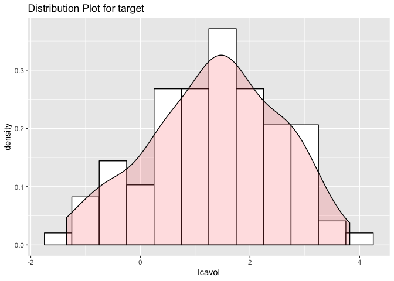
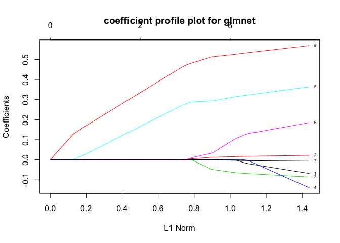
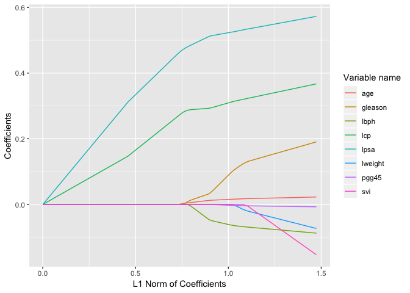
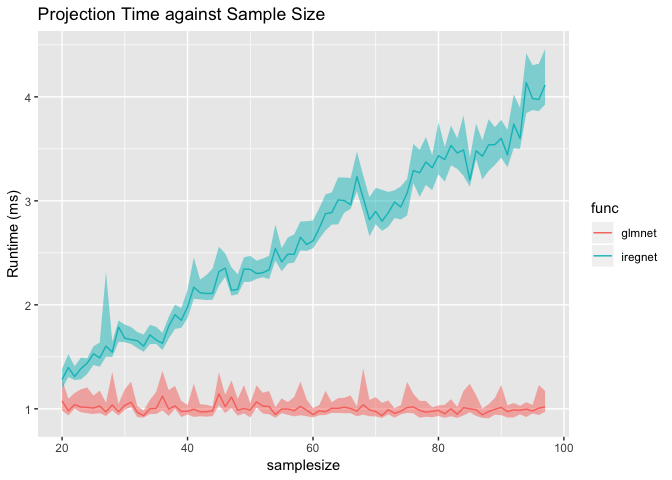
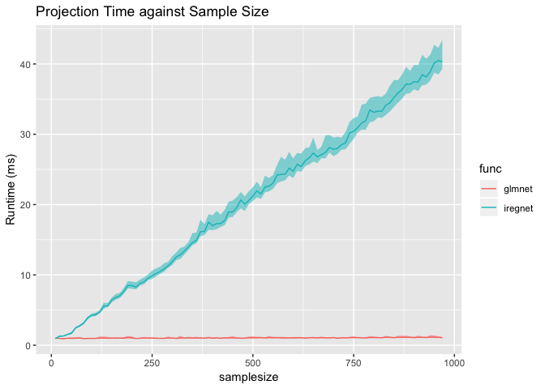
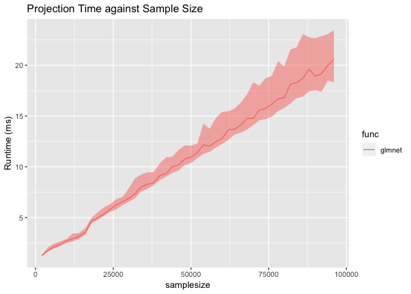

Easy Test for iregnet on CRAN
================
Ao Ni
2019/3/12

``` r
library(iregnet)
library(glmnet)
library(lasso2)
library(ggplot2)
library(penaltyLearning)
library(rmarkdown)
library(microbenchmark)
data("Prostate")
data('neuroblastomaProcessed')
```

Introduction
------------

Hello everyone, this is Ao Ni, a senior student major in Statistics who will pursue a master degree in Computer science in the near future.Here is my solution for iregnet on CRAN Tests.

### Test the two function

``` r
#Before we start, check the distribution of target 'lcavol'
ggplot(Prostate, aes(x=lcavol)) + 
  geom_histogram(aes(y=..density..),    
                 binwidth=.5,
                 colour="black", fill="white") +
  geom_density(alpha=.2, fill="#FF6666")+
  ggtitle("Distribution Plot for target")
```



The distribution of lcavol is close to normal distirbution.

``` r
X <- as.matrix(subset(Prostate,select = -lcavol))
#When set the left and right bounds same to the target, iregnet will perform lasso regression
Y <- as.matrix(cbind(Prostate['lcavol'],Prostate['lcavol']))
lasso.ire <- iregnet(x = X, y = Y, family = 'gaussian', alpha = 1)
lasso.glm <- glmnet(x = X, y = as.matrix(Prostate['lcavol']),
                    family = 'gaussian', alpha = 1)
```

``` r
plot(lasso.glm, label = T, main = 'coefficient profile plot for glmnet')
```



``` r
plot(lasso.ire, main = 'coefficient profile plot for iregnet')
```



The two coefficient profile against L1 Norm of Coefficients plot are not exactly the same, but very close. We can say that they perform the same procedure.

### Test the efficiency of two function

``` r
idx = sample(array(1:nrow(X)))
#perform efficiency test on iregnet
eval.ire <- apply(array(20:nrow(X)),1,function(n){
  X.batch = X[idx[1:n],]
  Y.batch.ire = Y[idx[1:n],]
  time.ire = microbenchmark(iregnet(x = X.batch, y = Y.batch.ire),times = 100L, unit = 'ms')
  return(as.vector(summary(time.ire)[1,c('median','lq','uq')]))
  })
eval.ire <- data.frame(matrix(unlist(eval.ire), nrow=length(eval.ire), byrow=T))
colnames(eval.ire)<- c('median','lq','uq')
eval.ire$func <- 'iregnet'
eval.ire$samplesize <- (array(20:nrow(X)))

#perform efficiency test on glmnet
eval.glm <- apply(array(20:nrow(X)),1,function(n){
  X.batch = X[idx[1:n],]
  Y.batch.glm = as.matrix(Prostate['lcavol'])[idx[1:n]]
  time.glm = microbenchmark(glmnet(x = X.batch, y = Y.batch.glm),times = 100L, unit = 'ms')
  return(as.vector(summary(time.glm)[1,c('median','lq','uq')]))
})
eval.glm <- data.frame(matrix(unlist(eval.glm), nrow=length(eval.glm), byrow=T))
colnames(eval.glm)<- c('median','lq','uq')
eval.glm$func <- 'glmnet'
eval.glm$samplesize <- (array(20:nrow(X)))
eval <- rbind(eval.glm,eval.ire)

p <- ggplot(eval, aes(samplesize))+
  geom_ribbon(aes(ymin=lq, ymax=uq,
                  fill=func, group=func), alpha=1/2)+
  geom_line(aes(y=median, group=func, colour=func))+
  ggtitle("Projection Time against Sample Size")+
  guides(fill="none")+
  ylab("Runtime (ms)")
p
```



It is obvious that the as the sample size increase for iregnet, time cost also increase. The increasing is linearity, which seems reasonable. However, the pattern for glmnet is different, time cost didn't increase along with sample size.

To better prove the hypothesis, I repeat the Prostate data for 10 more times and add some noises to some columns to expend my samplesize. Below is the efficiency test for new dataset.

``` r
#expend the dataset
Prostate.expend <- Prostate[rep(seq_len(nrow(Prostate)), 10), ]
Prostate.expend$lcavol <- Prostate.expend$lcavol+rnorm(nrow(Prostate.expend),0,0.1)
Prostate.expend$lweight <- Prostate.expend$lweight+rnorm(nrow(Prostate.expend),0,0.1)
Prostate.expend$lbph <-Prostate.expend$lbph+rnorm(nrow(Prostate.expend),0,0.1)
X <- as.matrix(subset(Prostate.expend,select = -lcavol))
Y <- as.matrix(cbind(Prostate.expend['lcavol'],Prostate.expend['lcavol']))
idx = sample(array(1:nrow(X)))

eval.ire <- apply(array(1:(nrow(X)/10))*10,1,function(n){
  
  X.batch = X[idx[1:n],]
  Y.batch.ire = Y[idx[1:n],]
  time.ire = microbenchmark(iregnet(x = X.batch, y = Y.batch.ire),times = 100L, unit = 'ms')
  return(as.vector(summary(time.ire)[1,c('median','lq','uq')]))
})
eval.ire <- data.frame(matrix(unlist(eval.ire), nrow=length(eval.ire), byrow=T))
colnames(eval.ire)<- c('median','lq','uq')
eval.ire$func <- 'iregnet'
eval.ire$samplesize <- array(1:(nrow(X)/10))*10

eval.glm <- apply(array(1:(nrow(X)/10))*10,1,function(n){
  X.batch = X[idx[1:n],]
  Y.batch.glm = as.matrix(Prostate.expend['lcavol'])[idx[1:n]]
  time.glm = microbenchmark(glmnet(x = X.batch, y = Y.batch.glm),times = 100L, unit = 'ms')
  return(as.vector(summary(time.glm)[1,c('median','lq','uq')]))
})
eval.glm <- data.frame(matrix(unlist(eval.glm), nrow=length(eval.glm), byrow=T))
colnames(eval.glm)<- c('median','lq','uq')
eval.glm$func <- 'glmnet'
eval.glm$samplesize <- array(1:(nrow(X)/10))*10
eval <- rbind(eval.glm,eval.ire)

p <- ggplot(eval, aes(samplesize))+
  geom_ribbon(aes(ymin=lq, ymax=uq,
                  fill=func, group=func), alpha=1/2)+
  geom_line(aes(y=median, group=func, colour=func))+
  ggtitle("Projection Time against Sample Size")+
  guides(fill="none")+
  ylab("Runtime (ms)")
p
```



This test prove my hypothesis. The time cost of glmnet didn't change to much with the increase of sample size. What if I increase the sample size to 100,000? This time I also run the test on glmnet

``` r
#expend the dataset to 100k
Prostate.expend <- Prostate[rep(seq_len(nrow(Prostate)), 1000), ]
Prostate.expend$lcavol <- Prostate.expend$lcavol+rnorm(nrow(Prostate.expend),0,0.1)
Prostate.expend$lweight <- Prostate.expend$lweight+rnorm(nrow(Prostate.expend),0,0.1)
Prostate.expend$lbph <-Prostate.expend$lbph+rnorm(nrow(Prostate.expend),0,0.1)
X <- as.matrix(subset(Prostate.expend,select = -lcavol))

idx = sample(array(1:nrow(X)))

eval.glm <- apply(array(1:(nrow(X)/2000))*2000,1,function(n){
  X.batch = X[idx[1:n],]
  Y.batch.glm = as.matrix(Prostate.expend['lcavol'])[idx[1:n]]
  time.glm = microbenchmark(glmnet(x = X.batch, y = Y.batch.glm),times = 100L, unit = 'ms')
  return(as.vector(summary(time.glm)[1,c('median','lq','uq')]))
})
eval.glm <- data.frame(matrix(unlist(eval.glm), nrow=length(eval.glm), byrow=T))
colnames(eval.glm)<- c('median','lq','uq')
eval.glm$func <- 'glmnet'
eval.glm$samplesize <- array(1:(nrow(X)/2000))*2000

p <- ggplot(eval.glm, aes(samplesize))+
  geom_ribbon(aes(ymin=lq, ymax=uq,
                  fill=func, group=func), alpha=1/2)+
  geom_line(aes(y=median, group=func, colour=func))+
  ggtitle("Projection Time against Sample Size")+
  guides(fill="none")+
  ylab("Runtime (ms)")
p
```



The running time still increase in a larger scale sample size for glmnet.
