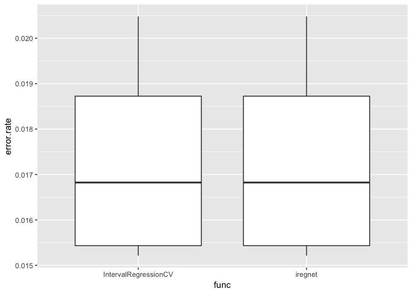

Hard\_Test
================
Ao Ni
2019/3/14

Hello everyone, this is Ao Ni, a senior student major in Statistics who will pursue a master degree in Computer science in the near future.Here is my solution for Hard Test.

``` r
library(iregnet)
library(glmnet)
library(lasso2)
library(ggplot2)
library(penaltyLearning)
library(rmarkdown)
library(caret)
library(microbenchmark)
data("Prostate")
data('neuroblastomaProcessed')
```

Let's start at a metrics function.

```{r, echo=FALSE}
test_error <- function(predict, label){
  len <- length(predict)
  errors <- 0
  for (i in array(1:len)){
    if ((label[i,1]<=predict[i]) && (label[i,2]>=predict[i])){
      
    }else{
      errors <- errors+1
    }
  }
  return(errors/len)
}
```


Then we can run a IntervalRegressionCV and test its precision (error rate).

``` r
set.seed(10)
fit.iter <- IntervalRegressionCV(X,Y.iter, n.folds = 5L)
```

    ## Loading required namespace: future.apply

    ## Loading required namespace: directlabels

``` r
perd.iter <- fit.iter$predict()
error_rate.iter <- test_error(perd.iter, Y.iter)
cat("The error rate for IntervalRegressionCV:",error_rate.iter)
```

    ## The error rate for IntervalRegressionCV: 0.01550614

The error rate is 1.55%! Then look at our iregnet function. First we start at a customized function to perform cross validation, which output prediction value.

``` r
iregnet.CV<- function(x, y, n.folds = 5L, seed = 10){
  set.seed(seed)
  idx <- array(1:nrow(x))
  pred.val <- array(0,nrow(x))
  fld <- createFolds(idx, 5)
  for(i in array(1:5)){
    x.test <- x[fld[[i]],]
    y.test <- y[fld[[i]],]
    x.train <- x[-fld[[i]],]
    y.train <- y[-fld[[i]],]
    fit <- iregnet(x = x.train, y = y.train)
    pred <- predict(fit, x.test)[,100]
    pred.val[fld[[i]]] <- pred
  }
  return(pred.val)
  
}
```

Run this function and test its error rate!

``` r
pred.ireg <- iregnet.CV(X,Y.ireg )
error_rate.ireg <- test_error(pred.ireg, Y.iter)
cat("The error rate for iregnet.CV:",error_rate.ireg)
```

    ## The error rate for iregnet.CV: 0.01901697

1.9%. The error rate of these two function seems to be almost the same.

Due to the randomness of these two test, simply compare a single pair of result is not accurate. To better perform the comparision, we run each test 20 times and use a T test to compare the result.

``` r
error_list.iter <- c()
error_list.ireg <- c()
for(seed in range(1:20)){
  set.seed(seed)
  cat(seed)
  fit.iter <- IntervalRegressionCV(X,Y.iter, n.folds = 5L)
  perd.iter <- fit.iter$predict()
  error_list.iter <- c(error_list.iter,test_error(perd.iter, Y.iter))
  pred.ireg <- iregnet.CV(X,Y.ireg, seed = seed)
  error_list.ireg <- c(error_list.ireg, test_error(pred.ireg, Y.iter))
}
plt.dat <- data.frame(func=as.factor(c(rep('IntervalRegressionCV',20),rep('iregnet',20))),
                      error.rate = c(error_list.iter,error_list.ireg)
                      )

p <- ggplot(plt.dat, aes(x = func, y = error.rate))+
  geom_boxplot()
p
```



``` r
t.test(error_list.ireg, error_list.iter)
```

    ## 
    ##  Welch Two Sample t-test
    ## 
    ## data:  error_list.ireg and error_list.iter
    ## t = 3.3489, df = 1.0312, p-value = 0.1787
    ## alternative hypothesis: true difference in means is not equal to 0
    ## 95 percent confidence interval:
    ##  -0.01000440  0.01790376
    ## sample estimates:
    ##  mean of x  mean of y 
    ## 0.01930954 0.01535986

P Value > 0.05, we cannot conclude that a significant difference exists in two fucnction under the alpha value of 0.05. 
