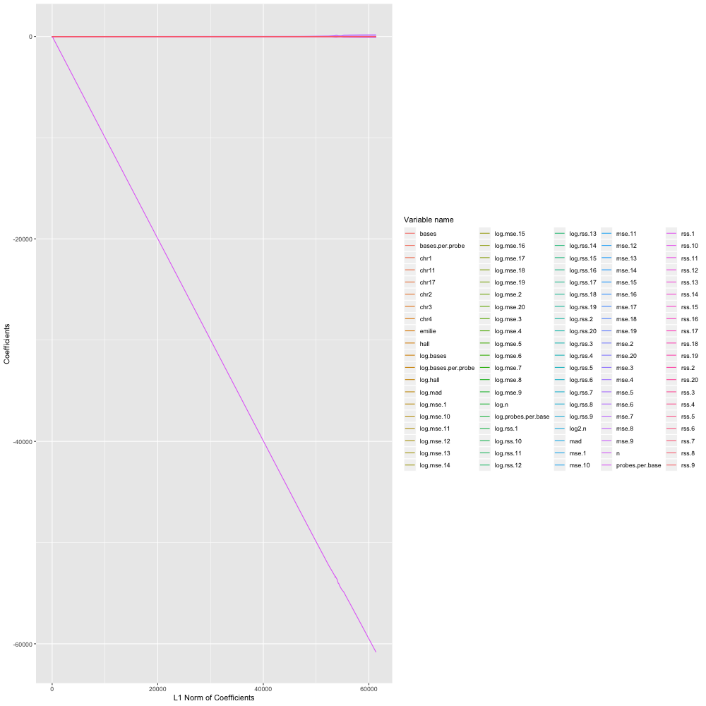
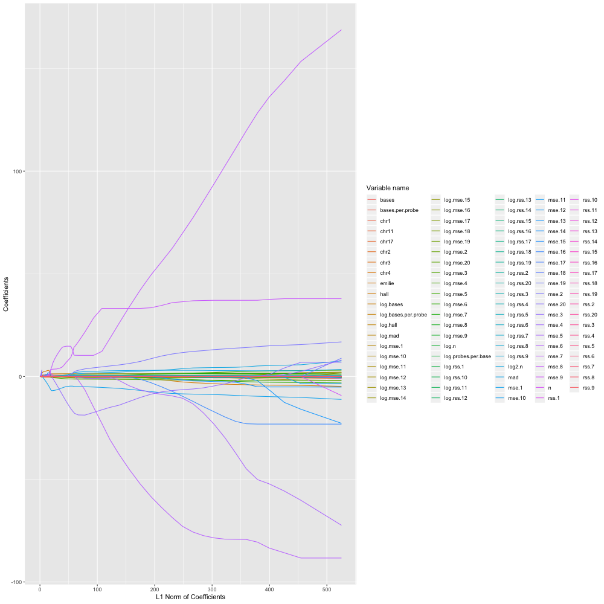

Medium\_Test
================
Ao Ni
2019/3/14


Hello everyone, this is Ao Ni, a senior student major in Statistics who will pursue a master degree in Computer science in the near future.Here is my solution for the medium tests.

``` r
library(iregnet)
library(glmnet)
library(lasso2)
library(ggplot2)
library(penaltyLearning)
library(rmarkdown)
library(microbenchmark)
data("Prostate")
data('neuroblastomaProcessed')
```

### Run iregnet on neuroblastomaProcessed data

Before we start to run the function, I would like to check the quality of neuroblastomaProcessed data.

``` r
X <- neuroblastomaProcessed$feature.mat
Y <- neuroblastomaProcessed$target.mat
Y[abs(Y) == Inf] = NA
summary(X)
```

    ##       mad             log.mad             hall            log.hall      
    ##  Min.   :0.02587   Min.   :-3.6546   Min.   :0.02987   Min.   :-3.5108  
    ##  1st Qu.:0.05121   1st Qu.:-2.9718   1st Qu.:0.06587   1st Qu.:-2.7201  
    ##  Median :0.06606   Median :-2.7173   Median :0.08588   Median :-2.4548  
    ##  Mean   :0.07954   Mean   :-2.6544   Mean   :0.10475   Mean   :-2.3870  
    ##  3rd Qu.:0.08850   3rd Qu.:-2.4248   3rd Qu.:0.11604   3rd Qu.:-2.1539  
    ##  Max.   :0.40987   Max.   :-0.8919   Max.   :0.66225   Max.   :-0.4121  
    ##      emilie            n              log.n           log2.n     
    ##  Min.   :2.594   Min.   :  66.0   Min.   :4.190   Min.   :1.433  
    ##  1st Qu.:2.730   1st Qu.: 175.0   1st Qu.:5.165   1st Qu.:1.642  
    ##  Median :2.773   Median : 246.0   Median :5.505   Median :1.706  
    ##  Mean   :2.792   Mean   : 526.2   Mean   :5.695   Mean   :1.731  
    ##  3rd Qu.:2.835   3rd Qu.: 409.8   3rd Qu.:6.016   3rd Qu.:1.794  
    ##  Max.   :3.108   Max.   :5937.0   Max.   :8.689   Max.   :2.162  
    ##      bases             log.bases     probes.per.base    
    ##  Min.   : 76655287   Min.   :18.15   Min.   :3.462e-07  
    ##  1st Qu.:134025767   1st Qu.:18.71   1st Qu.:1.094e-06  
    ##  Median :193611864   Median :19.08   Median :1.690e-06  
    ##  Mean   :182271375   Mean   :18.95   Mean   :2.946e-06  
    ##  3rd Qu.:242782924   3rd Qu.:19.31   3rd Qu.:2.034e-06  
    ##  Max.   :249053072   Max.   :19.33   Max.   :2.477e-05  
    ##  log.probes.per.base bases.per.probe   log.bases.per.probe
    ##  Min.   :-14.88      Min.   :  40372   Min.   :10.61      
    ##  1st Qu.:-13.73      1st Qu.: 491615   1st Qu.:13.11      
    ##  Median :-13.29      Median : 591859   Median :13.29      
    ##  Mean   :-13.26      Mean   : 693717   Mean   :13.26      
    ##  3rd Qu.:-13.11      3rd Qu.: 913918   3rd Qu.:13.73      
    ##  Max.   :-10.61      Max.   :2888425   Max.   :14.88      
    ##      rss.1               rss.2               rss.3          
    ##  Min.   :   0.2394   Min.   :   0.2268   Min.   :   0.2187  
    ##  1st Qu.:   1.4366   1st Qu.:   1.2758   1st Qu.:   1.1559  
    ##  Median :   2.4633   Median :   2.0805   Median :   1.8594  
    ##  Mean   :  26.1126   Mean   :  22.4429   Mean   :  20.8495  
    ##  3rd Qu.:   5.3314   3rd Qu.:   3.5370   3rd Qu.:   3.0978  
    ##  Max.   :1384.4497   Max.   :1335.0897   Max.   :1316.4955  
    ##      rss.4               rss.5               rss.6          
    ##  Min.   :   0.2078   Min.   :   0.2031   Min.   :   0.1958  
    ##  1st Qu.:   1.0820   1st Qu.:   1.0180   1st Qu.:   0.9657  
    ##  Median :   1.7280   Median :   1.6237   Median :   1.5518  
    ##  Mean   :  20.4113   Mean   :  20.0606   Mean   :  19.8363  
    ##  3rd Qu.:   2.8826   3rd Qu.:   2.7350   3rd Qu.:   2.6189  
    ##  Max.   :1308.6522   Max.   :1297.4321   Max.   :1289.5946  
    ##      rss.7               rss.8               rss.9          
    ##  Min.   :   0.1874   Min.   :   0.1782   Min.   :   0.1693  
    ##  1st Qu.:   0.9185   1st Qu.:   0.8782   1st Qu.:   0.8431  
    ##  Median :   1.4712   Median :   1.4157   Median :   1.3638  
    ##  Mean   :  19.6083   Mean   :  19.4337   Mean   :  19.2677  
    ##  3rd Qu.:   2.4988   3rd Qu.:   2.4099   3rd Qu.:   2.3181  
    ##  Max.   :1279.8980   Max.   :1272.0605   Max.   :1263.8653  
    ##      rss.10              rss.11              rss.12         
    ##  Min.   :   0.1621   Min.   :   0.1531   Min.   :   0.1466  
    ##  1st Qu.:   0.8135   1st Qu.:   0.7845   1st Qu.:   0.7545  
    ##  Median :   1.3171   Median :   1.2688   Median :   1.2292  
    ##  Mean   :  19.1303   Mean   :  18.9978   Mean   :  18.8802  
    ##  3rd Qu.:   2.2433   3rd Qu.:   2.1766   3rd Qu.:   2.1044  
    ##  Max.   :1256.0581   Max.   :1251.3676   Max.   :1244.1841  
    ##      rss.13              rss.14              rss.15         
    ##  Min.   :   0.1388   Min.   :   0.1336   Min.   :   0.1287  
    ##  1st Qu.:   0.7278   1st Qu.:   0.7041   1st Qu.:   0.6783  
    ##  Median :   1.1888   Median :   1.1555   Median :   1.1197  
    ##  Mean   :  18.7664   Mean   :  18.6620   Mean   :  18.5585  
    ##  3rd Qu.:   2.0436   3rd Qu.:   1.9825   3rd Qu.:   1.9236  
    ##  Max.   :1238.2921   Max.   :1233.1685   Max.   :1227.2765  
    ##      rss.16              rss.17              rss.18         
    ##  Min.   :   0.1220   Min.   :   0.1166   Min.   :   0.1107  
    ##  1st Qu.:   0.6585   1st Qu.:   0.6397   1st Qu.:   0.6197  
    ##  Median :   1.0893   Median :   1.0538   Median :   1.0252  
    ##  Mean   :  18.4642   Mean   :  18.3714   Mean   :  18.2841  
    ##  3rd Qu.:   1.8711   3rd Qu.:   1.8230   3rd Qu.:   1.7737  
    ##  Max.   :1222.5860   Max.   :1216.8301   Max.   :1212.1396  
    ##      rss.19              rss.20            log.rss.1      
    ##  Min.   :   0.1052   Min.   :   0.1005   Min.   :-1.4295  
    ##  1st Qu.:   0.6017   1st Qu.:   0.5837   1st Qu.: 0.3623  
    ##  Median :   0.9976   Median :   0.9705   Median : 0.9015  
    ##  Mean   :  18.1983   Mean   :  18.1169   Mean   : 1.2808  
    ##  3rd Qu.:   1.7240   3rd Qu.:   1.6808   3rd Qu.: 1.6736  
    ##  Max.   :1206.6186   Max.   :1201.9281   Max.   : 7.2331  
    ##    log.rss.2         log.rss.3         log.rss.4          log.rss.5      
    ##  Min.   :-1.4836   Min.   :-1.5200   Min.   :-1.57103   Min.   :-1.5940  
    ##  1st Qu.: 0.2436   1st Qu.: 0.1449   1st Qu.: 0.07882   1st Qu.: 0.0178  
    ##  Median : 0.7326   Median : 0.6203   Median : 0.54698   Median : 0.4847  
    ##  Mean   : 1.0331   Mean   : 0.8909   Mean   : 0.82199   Mean   : 0.7618  
    ##  3rd Qu.: 1.2633   3rd Qu.: 1.1307   3rd Qu.: 1.05868   3rd Qu.: 1.0061  
    ##  Max.   : 7.1968   Max.   : 7.1827   Max.   : 7.17675   Max.   : 7.1681  
    ##    log.rss.6          log.rss.7          log.rss.8         log.rss.9      
    ##  Min.   :-1.63074   Min.   :-1.67446   Min.   :-1.7250   Min.   :-1.7759  
    ##  1st Qu.:-0.03487   1st Qu.:-0.08499   1st Qu.:-0.1299   1st Qu.:-0.1707  
    ##  Median : 0.43945   Median : 0.38606   Median : 0.3476   Median : 0.3103  
    ##  Mean   : 0.71539   Mean   : 0.66991   Mean   : 0.6305   Mean   : 0.5929  
    ##  3rd Qu.: 0.96274   3rd Qu.: 0.91583   3rd Qu.: 0.8796   3rd Qu.: 0.8407  
    ##  Max.   : 7.16208   Max.   : 7.15454   Max.   : 7.1484   Max.   : 7.1419  
    ##    log.rss.10        log.rss.11        log.rss.12        log.rss.13     
    ##  Min.   :-1.8193   Min.   :-1.8765   Min.   :-1.9199   Min.   :-1.9748  
    ##  1st Qu.:-0.2064   1st Qu.:-0.2427   1st Qu.:-0.2816   1st Qu.:-0.3177  
    ##  Median : 0.2754   Median : 0.2381   Median : 0.2063   Median : 0.1729  
    ##  Mean   : 0.5582   Mean   : 0.5245   Mean   : 0.4926   Mean   : 0.4613  
    ##  3rd Qu.: 0.8080   3rd Qu.: 0.7778   3rd Qu.: 0.7440   3rd Qu.: 0.7147  
    ##  Max.   : 7.1357   Max.   : 7.1320   Max.   : 7.1262   Max.   : 7.1215  
    ##    log.rss.14        log.rss.15        log.rss.16         log.rss.17      
    ##  Min.   :-2.0126   Min.   :-2.0506   Min.   :-2.10342   Min.   :-2.14922  
    ##  1st Qu.:-0.3509   1st Qu.:-0.3881   1st Qu.:-0.41782   1st Qu.:-0.44681  
    ##  Median : 0.1445   Median : 0.1131   Median : 0.08549   Median : 0.05239  
    ##  Mean   : 0.4314   Mean   : 0.4019   Mean   : 0.37326   Mean   : 0.34527  
    ##  3rd Qu.: 0.6844   3rd Qu.: 0.6542   3rd Qu.: 0.62652   3rd Qu.: 0.60046  
    ##  Max.   : 7.1173   Max.   : 7.1126   Max.   : 7.10872   Max.   : 7.10400  
    ##    log.rss.18         log.rss.19         log.rss.20      
    ##  Min.   :-2.20132   Min.   :-2.25196   Min.   :-2.29724  
    ##  1st Qu.:-0.47857   1st Qu.:-0.50795   1st Qu.:-0.53839  
    ##  Median : 0.02492   Median :-0.00245   Median :-0.02995  
    ##  Mean   : 0.31793   Mean   : 0.29098   Mean   : 0.26450  
    ##  3rd Qu.: 0.57307   3rd Qu.: 0.54468   3rd Qu.: 0.51926  
    ##  Max.   : 7.10014   Max.   : 7.09558   Max.   : 7.09168  
    ##      mse.1               mse.2               mse.3          
    ##  Min.   :0.0009688   Min.   :0.0009241   Min.   :0.0008805  
    ##  1st Qu.:0.0053856   1st Qu.:0.0047866   1st Qu.:0.0043542  
    ##  Median :0.0095480   Median :0.0081046   Median :0.0073217  
    ##  Mean   :0.0272876   Mean   :0.0181822   Mean   :0.0136584  
    ##  3rd Qu.:0.0229023   3rd Qu.:0.0154529   3rd Qu.:0.0131379  
    ##  Max.   :1.0714954   Max.   :0.6784170   Max.   :0.2470009  
    ##      mse.4               mse.5              mse.6          
    ##  Min.   :0.0008703   Min.   :0.000840   Min.   :0.0008203  
    ##  1st Qu.:0.0040898   1st Qu.:0.003847   1st Qu.:0.0036753  
    ##  Median :0.0068116   Median :0.006410   Median :0.0061051  
    ##  Mean   :0.0127557   Mean   :0.012034   Mean   :0.0115814  
    ##  3rd Qu.:0.0120853   3rd Qu.:0.011298   3rd Qu.:0.0106643  
    ##  Max.   :0.2347619   Max.   :0.233226   Max.   :0.2315184  
    ##      mse.7               mse.8               mse.9          
    ##  Min.   :0.0007998   Min.   :0.0007798   Min.   :0.0007664  
    ##  1st Qu.:0.0035197   1st Qu.:0.0033939   1st Qu.:0.0032721  
    ##  Median :0.0058533   Median :0.0056061   Median :0.0053875  
    ##  Mean   :0.0111421   Mean   :0.0108058   Mean   :0.0104942  
    ##  3rd Qu.:0.0101025   3rd Qu.:0.0096603   3rd Qu.:0.0092431  
    ##  Max.   :0.2298997   Max.   :0.2282854   Max.   :0.2263361  
    ##      mse.10              mse.11              mse.12         
    ##  Min.   :0.0007521   Min.   :0.0007387   Min.   :0.0007233  
    ##  1st Qu.:0.0031579   1st Qu.:0.0030457   1st Qu.:0.0029552  
    ##  Median :0.0052022   Median :0.0049963   Median :0.0048185  
    ##  Mean   :0.0102264   Mean   :0.0099706   Mean   :0.0097437  
    ##  3rd Qu.:0.0088652   3rd Qu.:0.0085159   3rd Qu.:0.0082181  
    ##  Max.   :0.2247217   Max.   :0.2231858   Max.   :0.2221938  
    ##      mse.13              mse.14              mse.15         
    ##  Min.   :0.0007053   Min.   :0.0006855   Min.   :0.0006679  
    ##  1st Qu.:0.0028613   1st Qu.:0.0027706   1st Qu.:0.0027006  
    ##  Median :0.0046551   Median :0.0045153   Median :0.0043680  
    ##  Mean   :0.0095251   Mean   :0.0093264   Mean   :0.0091343  
    ##  3rd Qu.:0.0079212   3rd Qu.:0.0076341   3rd Qu.:0.0073899  
    ##  Max.   :0.2212529   Max.   :0.2205711   Max.   :0.2196823  
    ##      mse.16              mse.17              mse.18         
    ##  Min.   :0.0006505   Min.   :0.0006348   Min.   :0.0006207  
    ##  1st Qu.:0.0026279   1st Qu.:0.0025677   1st Qu.:0.0024946  
    ##  Median :0.0042591   Median :0.0041318   Median :0.0040163  
    ##  Mean   :0.0089564   Mean   :0.0087874   Mean   :0.0086283  
    ##  3rd Qu.:0.0071689   3rd Qu.:0.0069792   3rd Qu.:0.0067627  
    ##  Max.   :0.2190596   Max.   :0.2182698   Max.   :0.2175998  
    ##      mse.19              mse.20            log.mse.1       
    ##  Min.   :0.0006082   Min.   :0.0005944   Min.   :-6.93940  
    ##  1st Qu.:0.0024291   1st Qu.:0.0023683   1st Qu.:-5.22402  
    ##  Median :0.0039088   Median :0.0037992   Median :-4.65142  
    ##  Mean   :0.0084760   Mean   :0.0083305   Mean   :-4.41463  
    ##  3rd Qu.:0.0065419   3rd Qu.:0.0063271   3rd Qu.:-3.77652  
    ##  Max.   :0.2167468   Max.   :0.2161242   Max.   : 0.06906  
    ##    log.mse.2        log.mse.3        log.mse.4        log.mse.5     
    ##  Min.   :-6.987   Min.   :-7.035   Min.   :-7.047   Min.   :-7.082  
    ##  1st Qu.:-5.342   1st Qu.:-5.437   1st Qu.:-5.499   1st Qu.:-5.560  
    ##  Median :-4.815   Median :-4.917   Median :-4.989   Median :-5.050  
    ##  Mean   :-4.662   Mean   :-4.805   Mean   :-4.873   Mean   :-4.934  
    ##  3rd Qu.:-4.170   3rd Qu.:-4.332   3rd Qu.:-4.416   3rd Qu.:-4.483  
    ##  Max.   :-0.388   Max.   :-1.398   Max.   :-1.449   Max.   :-1.456  
    ##    log.mse.6        log.mse.7        log.mse.8        log.mse.9     
    ##  Min.   :-7.106   Min.   :-7.131   Min.   :-7.156   Min.   :-7.174  
    ##  1st Qu.:-5.606   1st Qu.:-5.649   1st Qu.:-5.686   1st Qu.:-5.722  
    ##  Median :-5.099   Median :-5.141   Median :-5.184   Median :-5.224  
    ##  Mean   :-4.980   Mean   :-5.026   Mean   :-5.065   Mean   :-5.103  
    ##  3rd Qu.:-4.541   3rd Qu.:-4.595   3rd Qu.:-4.640   3rd Qu.:-4.684  
    ##  Max.   :-1.463   Max.   :-1.470   Max.   :-1.477   Max.   :-1.486  
    ##    log.mse.10       log.mse.11       log.mse.12       log.mse.13    
    ##  Min.   :-7.193   Min.   :-7.211   Min.   :-7.232   Min.   :-7.257  
    ##  1st Qu.:-5.758   1st Qu.:-5.794   1st Qu.:-5.824   1st Qu.:-5.856  
    ##  Median :-5.259   Median :-5.299   Median :-5.335   Median :-5.370  
    ##  Mean   :-5.137   Mean   :-5.171   Mean   :-5.203   Mean   :-5.234  
    ##  3rd Qu.:-4.726   3rd Qu.:-4.766   3rd Qu.:-4.801   3rd Qu.:-4.838  
    ##  Max.   :-1.493   Max.   :-1.500   Max.   :-1.504   Max.   :-1.508  
    ##    log.mse.14       log.mse.15       log.mse.16       log.mse.17    
    ##  Min.   :-7.285   Min.   :-7.311   Min.   :-7.338   Min.   :-7.362  
    ##  1st Qu.:-5.889   1st Qu.:-5.914   1st Qu.:-5.942   1st Qu.:-5.965  
    ##  Median :-5.400   Median :-5.433   Median :-5.459   Median :-5.489  
    ##  Mean   :-5.264   Mean   :-5.294   Mean   :-5.322   Mean   :-5.350  
    ##  3rd Qu.:-4.875   3rd Qu.:-4.908   3rd Qu.:-4.938   3rd Qu.:-4.965  
    ##  Max.   :-1.512   Max.   :-1.516   Max.   :-1.518   Max.   :-1.522  
    ##    log.mse.18       log.mse.19       log.mse.20          chr1       
    ##  Min.   :-7.385   Min.   :-7.405   Min.   :-7.428   Min.   :0.0000  
    ##  1st Qu.:-5.994   1st Qu.:-6.020   1st Qu.:-6.046   1st Qu.:0.0000  
    ##  Median :-5.517   Median :-5.545   Median :-5.573   Median :0.0000  
    ##  Mean   :-5.378   Mean   :-5.404   Mean   :-5.431   Mean   :0.1659  
    ##  3rd Qu.:-4.996   3rd Qu.:-5.030   3rd Qu.:-5.063   3rd Qu.:0.0000  
    ##  Max.   :-1.525   Max.   :-1.529   Max.   :-1.532   Max.   :1.0000  
    ##       chr2             chr3             chr4             chr5  
    ##  Min.   :0.0000   Min.   :0.0000   Min.   :0.0000   Min.   :0  
    ##  1st Qu.:0.0000   1st Qu.:0.0000   1st Qu.:0.0000   1st Qu.:0  
    ##  Median :0.0000   Median :0.0000   Median :0.0000   Median :0  
    ##  Mean   :0.1679   Mean   :0.1679   Mean   :0.1665   Mean   :0  
    ##  3rd Qu.:0.0000   3rd Qu.:0.0000   3rd Qu.:0.0000   3rd Qu.:0  
    ##  Max.   :1.0000   Max.   :1.0000   Max.   :1.0000   Max.   :0  
    ##       chr6        chr7        chr8        chr9       chr10  
    ##  Min.   :0   Min.   :0   Min.   :0   Min.   :0   Min.   :0  
    ##  1st Qu.:0   1st Qu.:0   1st Qu.:0   1st Qu.:0   1st Qu.:0  
    ##  Median :0   Median :0   Median :0   Median :0   Median :0  
    ##  Mean   :0   Mean   :0   Mean   :0   Mean   :0   Mean   :0  
    ##  3rd Qu.:0   3rd Qu.:0   3rd Qu.:0   3rd Qu.:0   3rd Qu.:0  
    ##  Max.   :0   Max.   :0   Max.   :0   Max.   :0   Max.   :0  
    ##      chr11            chr12       chr13       chr14       chr15  
    ##  Min.   :0.0000   Min.   :0   Min.   :0   Min.   :0   Min.   :0  
    ##  1st Qu.:0.0000   1st Qu.:0   1st Qu.:0   1st Qu.:0   1st Qu.:0  
    ##  Median :0.0000   Median :0   Median :0   Median :0   Median :0  
    ##  Mean   :0.1671   Mean   :0   Mean   :0   Mean   :0   Mean   :0  
    ##  3rd Qu.:0.0000   3rd Qu.:0   3rd Qu.:0   3rd Qu.:0   3rd Qu.:0  
    ##  Max.   :1.0000   Max.   :0   Max.   :0   Max.   :0   Max.   :0  
    ##      chr16       chr17            chr18       chr19       chr20  
    ##  Min.   :0   Min.   :0.0000   Min.   :0   Min.   :0   Min.   :0  
    ##  1st Qu.:0   1st Qu.:0.0000   1st Qu.:0   1st Qu.:0   1st Qu.:0  
    ##  Median :0   Median :0.0000   Median :0   Median :0   Median :0  
    ##  Mean   :0   Mean   :0.1647   Mean   :0   Mean   :0   Mean   :0  
    ##  3rd Qu.:0   3rd Qu.:0.0000   3rd Qu.:0   3rd Qu.:0   3rd Qu.:0  
    ##  Max.   :0   Max.   :1.0000   Max.   :0   Max.   :0   Max.   :0  
    ##      chr21       chr22        chrX  
    ##  Min.   :0   Min.   :0   Min.   :0  
    ##  1st Qu.:0   1st Qu.:0   1st Qu.:0  
    ##  Median :0   Median :0   Median :0  
    ##  Mean   :0   Mean   :0   Mean   :0  
    ##  3rd Qu.:0   3rd Qu.:0   3rd Qu.:0  
    ##  Max.   :0   Max.   :0   Max.   :0

We can see that some variables have zero variance. No need to include them in the test.

``` r
select.col <- apply(X,2,function(x){
  return(max(x)-min(x)!=0)
})
X = X[,select.col]
set.seed(1)
#fit the data!
fit.ire <- iregnet(x = X, y = Y)
plot(fit.ire)
```




Seems one of the variables has very small variance, which lead to a very large coefficiency absolute value. I omit it in the next plot.

``` r
fit.ire$beta <- fit.ire$beta[-c(which.min(fit.ire$beta[,100])),]
plot(fit.ire)
```



This plot seems more informative than the previous one.
